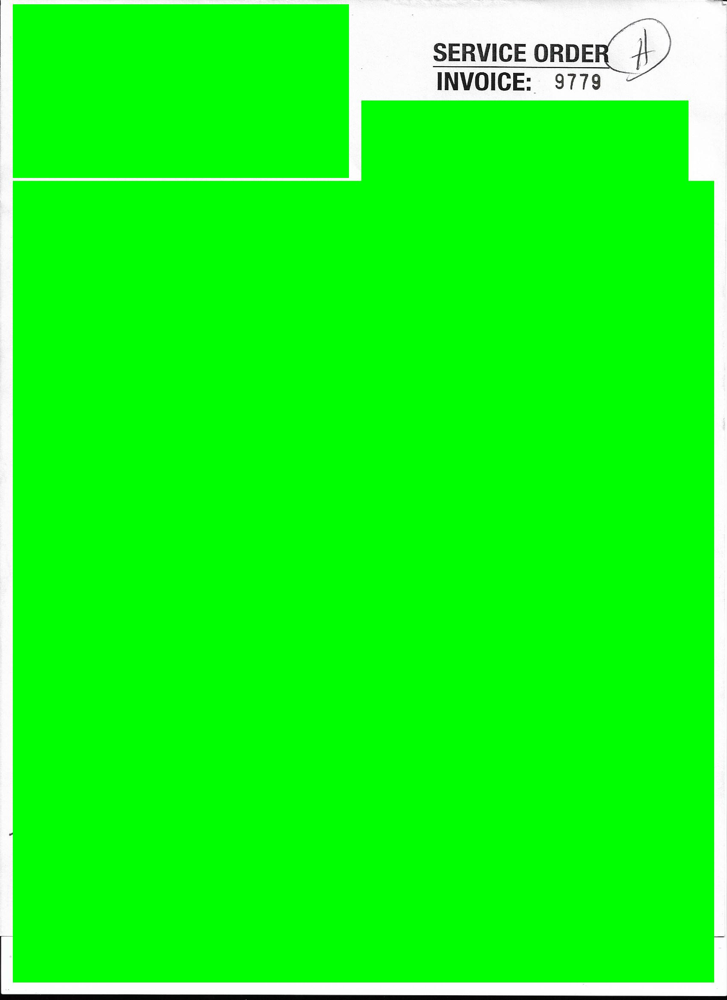

# InvoiceOrganizer

A program for scanning invoice data and organizing in Documents accordingly.

Utilizes OpenCV template matching and Tesseract OCR.

Note: if building a jar, include companies.txt in the same directory as the jar.

## Screenshot

## Invoice Example

